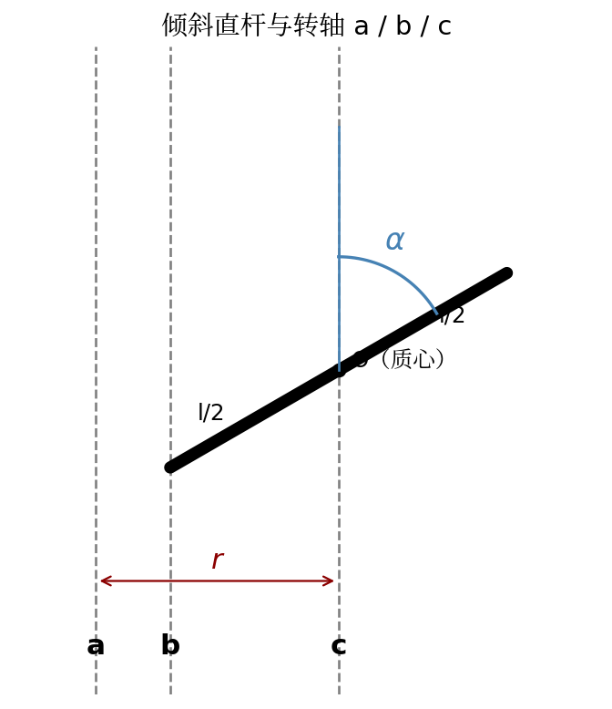
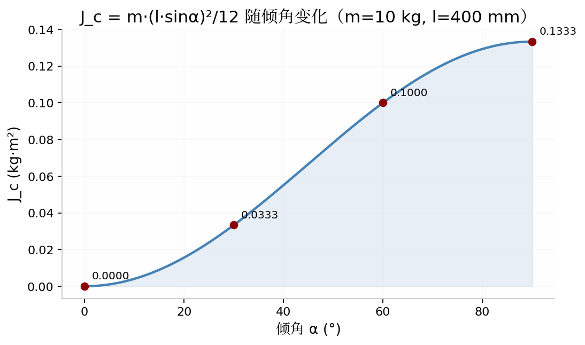

# 惯量计算

转动惯量 $J$ 描述物体对转动的"惯性"，单位 kg·m²。

$$
J = \int r^2 \, dm
$$

$r$ 为质元到转轴的垂直距离。同一物体绕不同轴的惯量完全不同——**算惯量先说清绕哪根轴**。

---

## 基础形状

### 实心圆柱（绕对称轴）

质量 $m$、外径 $D$ 的实心圆柱绕自身对称轴：

$$
J = \frac{m D^2}{8}
$$

```python
mc.solid_cylinder(mass=10, outer_diameter=100)   # 0.0125 kg·m²
```

??? note "推导"
    将圆柱切成薄圆环，半径 $r$ 处质量 $dm = \frac{2m}{R^2} r\,dr$，

    $$
    J = \int_0^R r^2\, dm = \frac{2m}{R^2}\cdot\frac{R^4}{4} = \frac{mR^2}{2} = \frac{mD^2}{8}
    $$

### 空心圆柱

外径 $D$、内径 $d$：

$$
J = \frac{m(D^2 + d^2)}{8}
$$

### 其他

| 函数 | 公式 |
|------|------|
| `point_mass(m, r)` | $J = m r^2$ |
| `straight_rod(m, l)` | $J = \frac{m l^2}{12}$（过质心、垂直于杆） |
| `ball_screw(m, p)` | $J = m\left(\frac{p}{2\pi}\right)^2$ |
| `conveyor_belt(m, D)` | $J = m\left(\frac{D}{2}\right)^2$ |
| `gearbox(J_load, ratio)` | $J = \frac{J_{load}}{i^2}$（折算到电机轴） |

---

## 倾斜直杆

杆长 $l$，与转轴夹角 $\alpha$，质心在 $l/2$ 处。质元到转轴的距离按 $\sin\alpha$ 投影，积分得：



$$
\begin{aligned}
J_a &= m\left[r^2 + \frac{(l\sin\alpha)^2}{12}\right] && \text{轴 a：距质心 } r \text{ 的平行轴} \\
J_b &= \frac{m(l\sin\alpha)^2}{3} && \text{轴 b：过杆端点} \\
J_c &= \frac{m(l\sin\alpha)^2}{12} && \text{轴 c：过质心} \\
J_z &= \frac{m l^2}{12} && \text{z 轴：过质心且垂直于杆}
\end{aligned}
$$

```python
raw = mc.inclined_rod(mass=10, length=400, alpha=60, r=100)
# J_a = 0.20000 kg·m²
# J_b = 0.40000 kg·m²
# J_c = 0.10000 kg·m²
# J_z = 0.13333 kg·m²
```

!!! tip "特例验证"
    $\alpha = 90°$ 时 $J_c = \frac{ml^2}{12}$，即 `straight_rod` 的结果——库里的互锁测试就是这么校验的。

### 倾角对惯量的影响

用 `inclined_rod` 实际计算不同 $\alpha$ 下的 $J_c$（$m=10$ kg，$l=400$ mm）：



$\alpha=0$（杆与轴平行）时 $J_c=0$；$\alpha=90°$ 时最大。

---

## 惯量张量（三维）

绕固定轴转动的惯量是标量；**任意姿态**下需要用 $3\times3$ 张量：

$$
\mathbf{I} = \begin{bmatrix} I_{xx} & -I_{xy} & -I_{xz} \\ -I_{xy} & I_{yy} & -I_{yz} \\ -I_{xz} & -I_{yz} & I_{zz} \end{bmatrix}
$$

### 任意方向轴的等效惯量

轴向单位向量 $\mathbf{n}$ 时：

$$
J = \mathbf{n}^{\mathsf{T}} \, \mathbf{I} \, \mathbf{n}
$$

```python
I = mc.solid_cylinder_tensor(10, 100, 200)   # 3×3 张量
mc.inertia_about_axis(I, [1, 1, 0])           # 绕 45° 轴（自动单位化）
mc.inertia_about_axis(I, [[1,0,0],[0,0,1]])   # 批量
```

### 平行移轴定理（张量形式）

质心张量 $\mathbf{I}_c$ 平移向量 $\mathbf{r}$ 后：

$$
\mathbf{I} = \mathbf{I}_c + m\left(\mathbf{r}^{\mathsf{T}}\mathbf{r}\,\mathbf{E} - \mathbf{r}\,\mathbf{r}^{\mathsf{T}}\right)
$$

```python
I_new = mc.parallel_axis_tensor(I, 10, [0.5, 0, 0])
```
